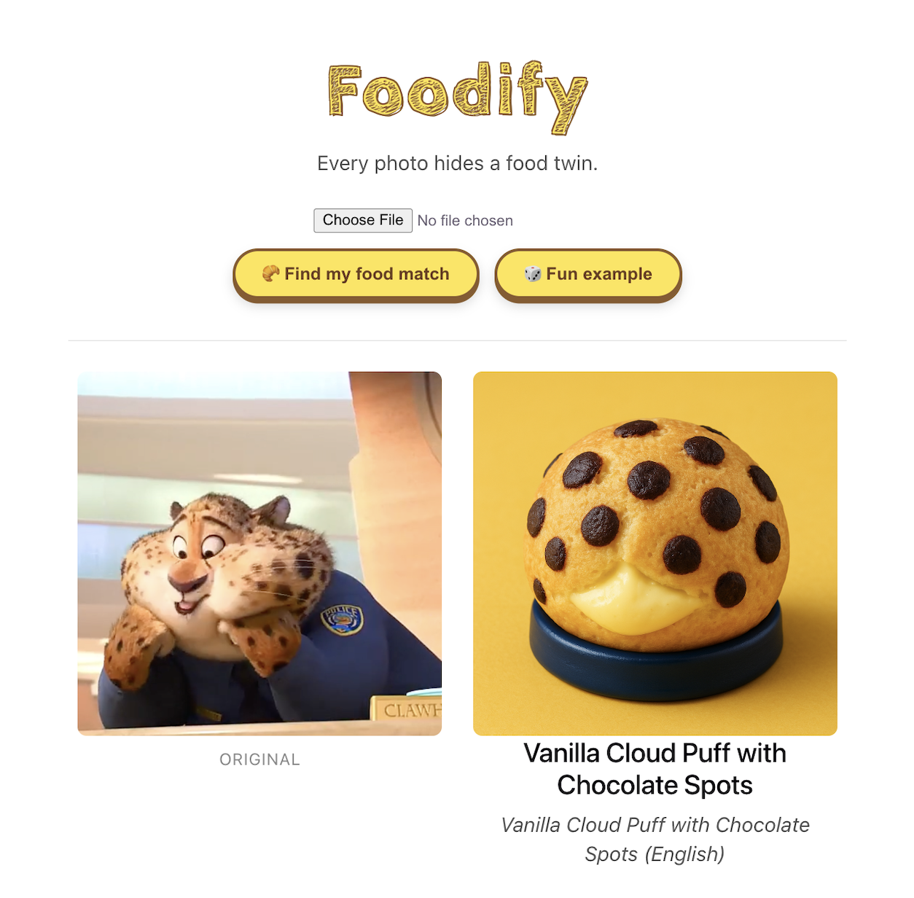

<!--
  TODO: add a logo/icon (e.g. docs/icon.svg or docs/icon.png), then
  uncomment this:
  

    
  

-->

<h1 align="center">Foodify</h1>

  <strong>Every photo hides a food twin.</strong>
   
  Point a photo at anything and find the food it most resembles.

  
  
  

  <a href="https://zoetian.me/food_translator/"><strong>Try the live demo →</strong></a>

<!--
  TODO: add your demo GIF here — record a quick clip of the live site
  (upload a photo -> click "Find my food match" -> reveal the result),
  save it as docs/demo.gif, and this will render automatically.
-->

## Getting started

1. Open [the live demo](https://zoetian.me/food_translator/)
2. Upload or snap a photo, or click **Fun example** for an instant demo.
3. Click **Find my food match** and meet your food twin ✨

The live demo shares a small daily quota to keep API costs in check — if
it's exhausted, try again tomorrow, or run your own copy locally with
your own OpenAI key (see Development below).

## Development

Want to run Foodify locally, understand how it works under the hood, or
deploy your own copy? See [DevNotes.md](DevNotes.md).

## Support this project

  

If Foodify made you smile, consider buying me a coffee — it helps cover
hosting/API costs and keeps the live demo running.

---
